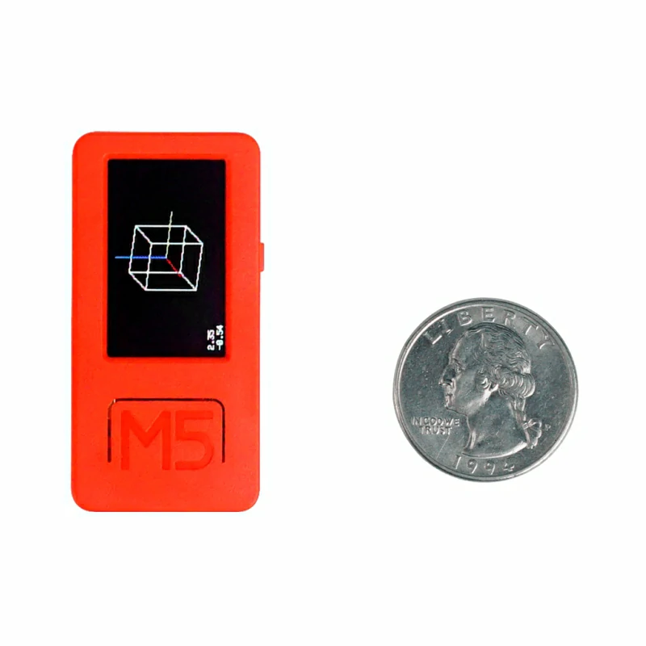
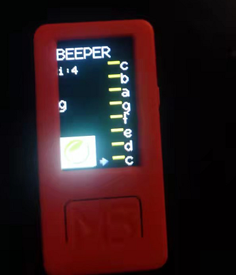

# 2022暑假练 M5StickC PLUS 
### 硬件
主控采用ESP32-PICO-D4模组,具备WIFI功能,小巧的机身内部集成了丰富的硬件资源,如红外、RTC、麦克风、LED、IMU、按键、蜂鸣器、PMU等,在保留原有M5StickC功能的基础上加入了无源蜂鸣器,同时屏幕尺寸升级到1.14寸、**135*240分辨率的TFT屏幕**,相较之前的0.96寸屏幕增加18.7%的显示面积,电池容量达到120mAh,接口同样支持HAT与Unit系列产品。
*开机:按复位按键,持续至少 2 秒 关机:按复位按键,持续至少 6 秒*
|LCD屏幕|ESP32|Flash闪存|
|---|---|---|
|1.14 inch, 135*240 Colorful TFT LCD, ST7789v2|240MHz dual core, 600 DMIPS, 520KB SRAM, Wi-Fi|4MB Flash|


### 环境配置
使用arduino进行配置，项目的库文件在[github](https://github.com/m5stack/M5StickC-Plus), arduino环境的配置见[Arduino IDE 环境搭建 - M5StickC Plus](https://docs.m5stack.com/zh_CN/quick_start/m5stickc_plus/arduino)
由于github文件都是近期更新的, 所以arduino的库版本也安装最新的,  验证没有出现问题

### 软件
软件的逻辑是：
初始化-->显示界面-->检测位置，按键-->重新绘制，播放声音
``setup``程序中使用了lcd库进行界面的绘制的初始化，对内置陀螺仪和蜂鸣器分别初始化。``showUI``程序中是界面的绘制，方便再次调用实现刷新。这块lcd屏幕使用的时rgb565的色彩，在对图像进行转换的时候，可以使用[ImageConverter (UTFT)](http://rinkydinkelectronics.com/t_imageconverter565.php)，同时对一些数据进行宏定义。

主程序
```c_cpp
#include <M5StickCPlus.h>

#define NOTE_C6  1047
#define NOTE_CS6 1109
#define NOTE_D6  1175
#define NOTE_DS6 1245
#define NOTE_E6  1319
#define NOTE_F6  1397
#define NOTE_FS6 1480
#define NOTE_G6  1568
#define NOTE_GS6 1661
#define NOTE_A6  1760
#define NOTE_AS6 1865
#define NOTE_B6  1976
#define NOTE_C7  2093
#include "arow.h"
#include"logo6055.h"
float accX = 0;
float accY = 0;
float accZ = 0;
char nn[8]={'c','d','e','f','g','a','b','c'};
int notes[8]={NOTE_C6,NOTE_D6,NOTE_E6,NOTE_F6,NOTE_G6,NOTE_A6,NOTE_B6,NOTE_C7};
float temp = 0;
void showUI()
{
  M5.Lcd.drawString("BEEPER",0,10,2);
  M5.Lcd.fillRect(90,20,0,240,TFT_RED);
  for(int i=0;i<8;i++){
  M5.Lcd.drawString(String(nn[i]),112,210-(i*25),2);
  M5.Lcd.fillRect(90,220-(i*25),20,4,TFT_YELLOW);
  M5.Lcd.pushImage(0,180,60,55,logo6055);
  }
}
void setup() {
  //pinMode(37,INPUT);
  M5.begin();
  M5.Lcd.setRotation(0);
  M5.Lcd.fillScreen(BLACK);
  M5.Lcd.setTextSize(2);
  M5.Lcd.setSwapBytes(true);
  delay(100);
  M5.imu.Init();
  //pinMode(37,INPUT_PULLUP);
  showUI();
  M5.Beep.begin();
  }

int y=0;
int y2=0;
int i=0;
bool pres=false;
void loop() {
  M5.begin();
  showUI();
 if(pres==0){
  delay(10);
  M5.imu.getAccelData(&accX,&accY,&accZ);
    int v=int(accY*1000);
    i=map(v,0,1000,0,8);
    y=220-(i*25);
    if(i>7)
    i=7;
    if(i<0)
    i=0;
 if(y!=y2){
 M5.Lcd.fillRect(66,y2,16,16,TFT_BLACK);
 M5.Lcd.pushImage(66,y,16,16,arr);
 y2=y;
 }}
M5.update();
  if((M5.BtnA.isPressed()) || (M5.BtnB.isPressed())) {
    delay(20);
    pres=1;
    M5.lcd.fillScreen(BLACK);
    M5.lcd.drawString("i:"+String(i),1,50,1);
    showUI();
    M5.Beep.tone(notes[i],200);
    M5.Lcd.drawString(String(nn[i]),0,100,2);
    M5.update();
    }
  else
  {
    //M5.Lcd.fillRect(1,50,40,40,TFT_BLACK);
    //M5.Lcd.fillRect(0,100,40,40,TFT_BLACK);
    M5.Beep.mute(); 
    pres=0;
  }
}
```
进入主程序，初始化陀螺仪，上下旋转M5Stick时，陀螺仪读出的加速度值通过map函数映射到我们需要的范围内，比如这里时八个音。也可以通过修改这个map，来实现更小范围内的移动。使用``M5.update()``进行按键状态的检测。位置的移动检测通过了对比当前位置信息是否变化，在按键松开的情况下，如果位置出现了移动，则更新位置，同时提供当前位置的信息，记录在``i``。当按键按下时，通过这个位置读取对应音调的频率，使用``Beep.tone``输出对应的频率。按键不松开时，将一直播放该声音。同时屏幕显示播放的音调，在下一次按下更新。
### 效果展示
通过上下旋转，调节音调，按37 39 任意一个按键可以触发声音


### 项目收获
m5stickplus开发板的体积小巧，颜值高，同时集合了很多传感器，非常适合新手进行编程的学习。通过本次项目也得到了很多收获。